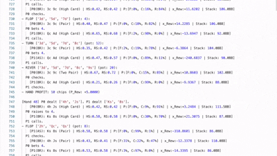

## GTO Poker Bot using Neural Fictitious Self-Play (NFSP)

This project is a Python-based implementation of a Texas Hold'em poker bot that learns to play using the Neural Fictitious Self-Play (NFSP) algorithm. The goal is to train an agent that approximates a Game Theory Optimal (GTO) strategy for heads-up (two-player) No-Limit Texas Hold'em.

The agent learns by playing against itself, using a combination of Reinforcement Learning (for finding the best response) and Supervised Learning (for building an average strategy).



###### 1. Clone the Repository
```bash
git clone https://github.com/dan-k-k/GTO-Poker-AI
cd GTO-Poker-AI
```

###### 2. Set Up a Virtual Environment
```bash
# Create the virtual environment
python -m venv venv

# Activate (macOS/Linux)
source venv/bin/activate

# Activate (Windows)
.\venv\Scripts\activate
```

###### 3. Install requirements
```bash
pip install -r requirements.txt
```

##### Train!
```bash
python -m app.train_nfsp
# You can monitor training_output/hand_history.log to see agents' plays

# If you make performance improvements, benchmark with:
python -m cProfile -o testtrain.pstats -m unittest tests.test_training
snakeviz testtrain.pstats
```

## Play against a trained Agent
```bash
python main.py
# Go to: http://127.0.0.1:5001
```